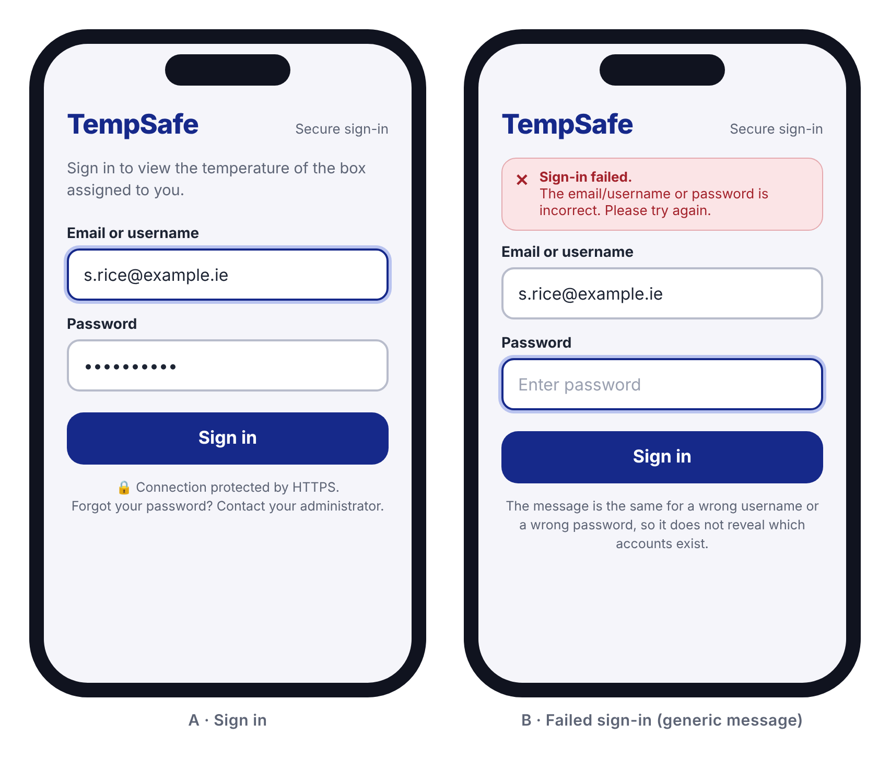
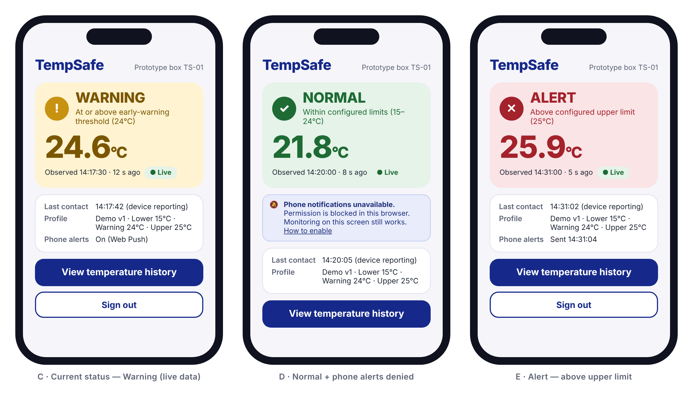
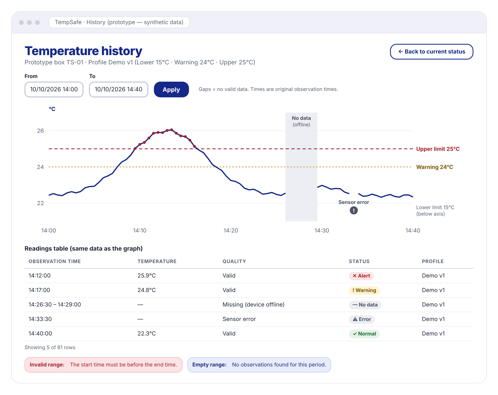
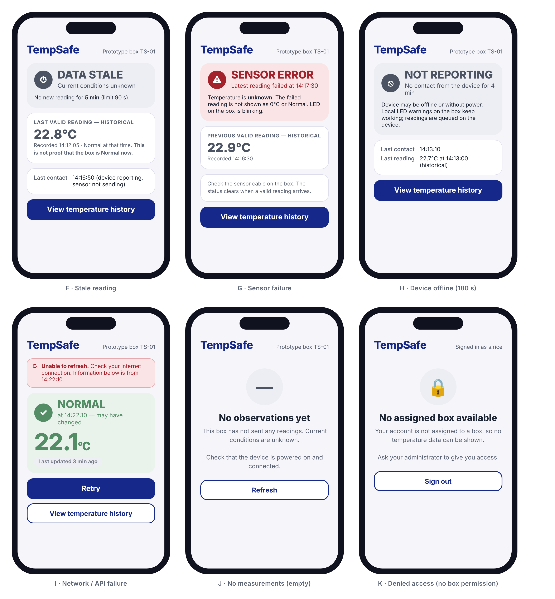

# Smart Box: user interface design

## Planned platform

TempSafe will be a responsive web application with a Python/FastAPI backend and an HTML, CSS and JavaScript frontend.
Planned Progressive Web App (PWA) support would let users add a home-screen icon and open the same web application
in a standalone window on supported phones. PWA installation and Web Push require browser/platform testing.
A separate native mobile application is likely to follow the web application, subject to a final team decision.

Home-screen access is a planned enhancement; the browser interface remains the baseline. A web app manifest will
define the application name, icons, start URL and standalone display mode. The proposed Web Push channel will use
a service worker and explicit notification permission. On iOS/iPadOS, Web Push requires the web application to be
added to the home screen. Installation does not make temperature data live while offline.

References: [MDN: Making PWAs installable](https://developer.mozilla.org/en-US/docs/Web/Progressive_web_apps/Guides/Making_PWAs_installable)
and [WebKit: Web Push for Web Apps on iOS and iPadOS](https://webkit.org/blog/13878/web-push-for-web-apps-on-ios-and-ipados/).

## Sign-in and access

Users open the HTTPS web application on a phone or desktop browser. Sign-in has labelled login-identifier and password
fields, a Sign in button and a generic failed-login message. Successful sign-in opens the user's assigned prototype box;
an unassigned account sees an explicit no-access message. Sign out invalidates the server session. All box/history
requests are authorised by the backend; hiding a button is not access control.

**Figure 1.** Sign-in screen (A) and failed sign-in (B). Fields have visible labels and a visible focus outline. A failed attempt shows one generic message ("The email/username or password is incorrect"), so the screen does not reveal whether an account exists. The page is served only over HTTPS. A successful sign-in opens the user's assigned box.

## Current status

**Figure 2.** Current status screen for Warning (C), Normal with phone notifications denied (D) and Alert (E). Each state uses a colour, a symbol (! ✓ ✕) and a text label, so the state does not depend on colour alone. The screen shows the temperature in °C, the observation time and its age, a "Live" freshness label, the last device contact and the profile limits. The Alert wording is "Above configured upper limit"; it is not a clinical assessment. When Web Push permission is denied (D), a banner explains that phone alerts are unavailable while monitoring on the screen continues.

## Temperature history

**Figure 3.** History screen. A From/To filter selects the time range. The graph shows the Upper limit and Warning lines with labels. Samples above the upper limit are marked. A period with no data is drawn as a gap, and a sensor-error attempt is marked separately, not joined to the line. A readable table below the graph gives the same data (observation time, temperature, quality, status, profile) for screen-reader and keyboard users. An empty range shows "No observations found"; an invalid range (From after To) shows an error message.

## Required states

**Figure 4.** Error and empty states. F: Data stale. No new reading for longer than 90 s; the last value is labelled historical and "current conditions unknown". G: Sensor error. The failed sample is never shown as 0°C or Normal. H: Not reporting. No device contact for more than 180 s; last contact and last reading are shown separately. I: Network/API failure. Data is visibly dated and a Retry button is offered. J: No observations yet. K: Denied access. An account without an assigned box sees no data from any other box.

## Accessibility checks applied to all mock-ups
- Status is shown by text + symbol + colour (not colour alone).
- Text and status colours are chosen for readable contrast on their backgrounds.
- All form fields have visible labels; the focused field has a visible outline.
- Buttons are large touch targets (full width, about 48 px high).
- The graph has an equivalent data table.

## Earlier concepts

The first team concepts (`current-status-concept.png`, `history-concept.png`) are kept in `docs/assets/design` as the starting point of the design. They were replaced because they used out-of-scope labels (vehicle, medicines, excursion timer) and wording such as "Above safe limit".

Related documents: [UI screen flow](ui-screen-flow.md), [UI wording guide](ui-wording.md), [UI style guide](ui-style-guide.md), [Accessibility acceptance criteria](accessibility-criteria.md), [Design principles](design-principles.md).
