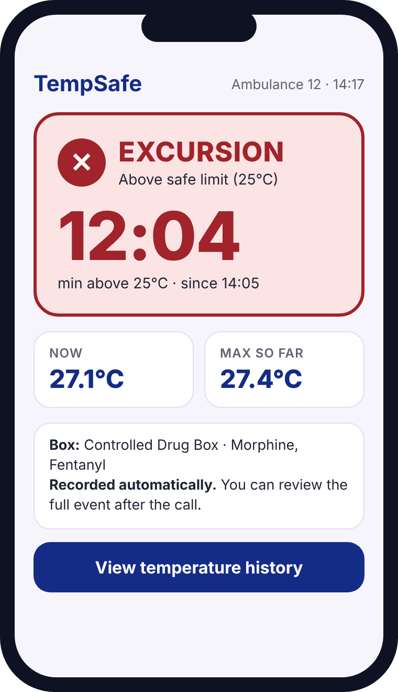
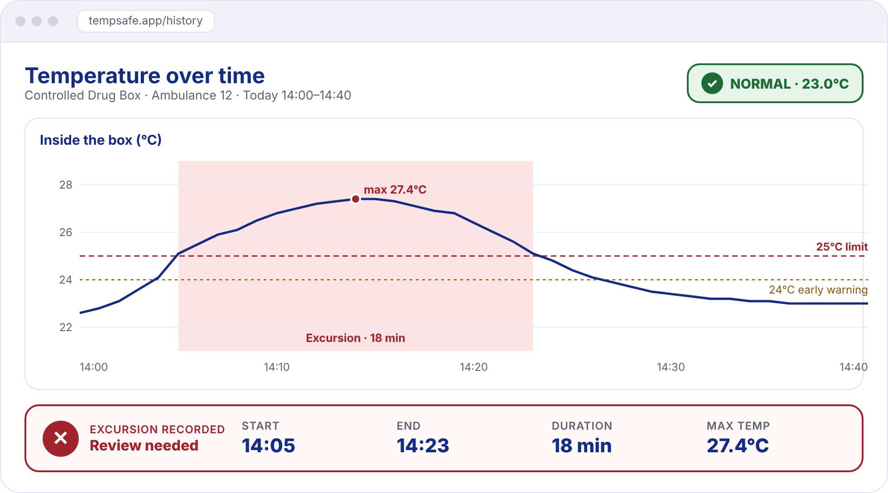

# Smart Box: user interface design

## Sign-in and access

Users open the HTTPS web application on a phone or desktop browser. Sign-in has labelled login-identifier and password fields, a Sign in button and a generic failed-login message. Successful sign-in opens the user's assigned prototype box; an unassigned account sees an explicit no-access message. Sign out invalidates the server session. All box/history requests are authorised by the backend; hiding a button is not access control.

## Current status concept

## History concept

