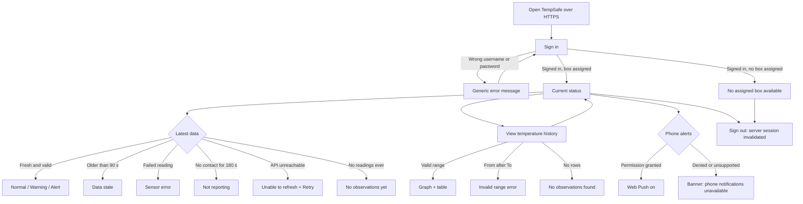

# UI screen flow

Author: Maryna Hordiienko

This diagram shows how a user moves between TempSafe screens. Every box and history request is checked by the backend; hiding a button is not access control.

## Screens

| Screen | Purpose | Mock-up |
|---|---|---|
| Sign in | Authenticate the user | `ui-signin.png` (A, B) |
| Current status | Show the latest temperature, status and freshness | `ui-dashboard.png` (C, D, E) |
| Error and empty states | Explain stale, failed, offline and missing data | `ui-states.png` (F–K) |
| History | Review earlier readings by date range | `ui-history.png` |
