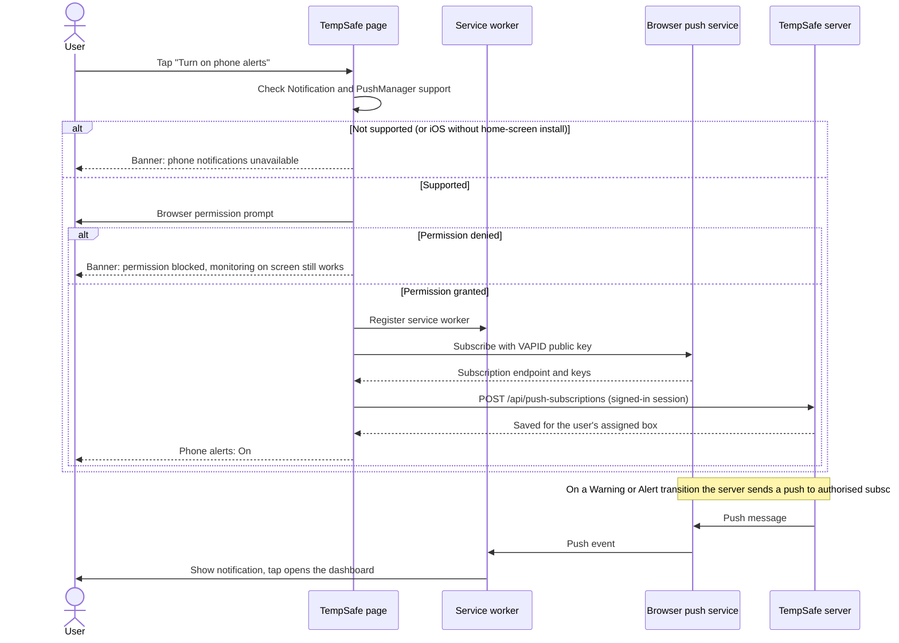

# Web Push permission flow

Author: Maryna Hordiienko (frontend and Web Push integration)

[ui-design.md](ui-design.md) states that TempSafe plans Web Push with a service worker and explicit permission. This document shows the detailed flow. The browser asks for permission only after the user chooses to turn alerts on, never on first page load.

## Flow

## UI states

| State | What the user sees |
|---|---|
| Not asked yet | Button "Turn on phone alerts" |
| Granted | "Phone alerts: On (Web Push)" |
| Denied | Info banner with a link "How to enable" |
| Unsupported | Info banner explaining that this browser cannot show phone alerts |
| iOS / iPadOS | Instruction to add TempSafe to the home screen first |

## Server rules (from design document Section 6)

- A notification is created only when the current state changes to Warning or Alert. Unchanged repeated states are suppressed.
- Delayed historical uploads do not trigger current warnings.
- Failed deliveries are retried and marked; duplicates are prevented.
- Target: receipt within 60 seconds of an online Warning/Alert transition. This is measured on supported phones, not guaranteed.
- Notification text contains no account details and links to the signed-in dashboard.

## Planned browser checks

Chrome on Android, Safari on iOS 16.4+ (home-screen web app), Chrome and Edge on Windows.
