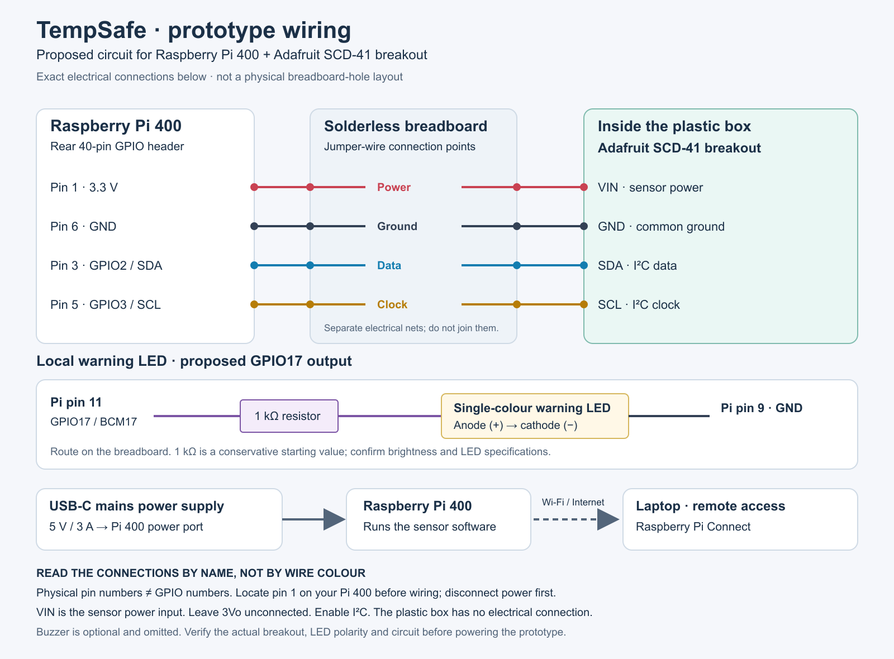

# Prototype wiring — Raspberry Pi 400 and Adafruit SCD-41

## Sensor connections

| Raspberry Pi 400 physical pin | Function     | Adafruit SCD-41 breakout connection |
|-------------------------------|--------------|-------------------------------------|
| 1                             | 3.3 V power  | VIN                                 |
| 6                             | Ground       | GND                                 |
| 3                             | GPIO2 / SDA1 | SDA                                 |
| 5                             | GPIO3 / SCL1 | SCL                                 |

## Proposed LED connections

Physical pin 11 (BCM GPIO17) → 1 kΩ series resistor → LED anode; LED cathode → physical pin 9 (GND). This matches the
SVG/PNG drawing. Verify the actual LED ratings, polarity and brightness before powering the circuit. The resistor value
is a proposal, not a measured result.

## What each part does

| Part                     | Role                                                                                                                   |
|--------------------------|------------------------------------------------------------------------------------------------------------------------|
| Plastic prototype box    | Holds the sensor; the container itself has no electrical connection.                                                   |
| Adafruit SCD-41 breakout | Measures temperature inside the box; humidity and CO₂ reporting are outside this release.                              |
| Raspberry Pi 400         | Reads the sensor, runs the monitoring software and controls the warning LED.                                           |
| Solderless breadboard    | Provides temporary electrical connections without soldering; it has no processor or Wi-Fi.                             |
| Jumper wires             | Carry power, ground and signals between components. Colours in the diagram are labels, not a required colour standard. |
| Resistor                 | Limits current through the warning LED.                                                                                |
| Single-colour LED        | Provides local visual feedback. It is an output device, not a sensor.                                                  |
| USB-C power supply       | Powers the Pi 400 from mains; use a compatible 5 V / 3 A supply.                                                       |
| Laptop                   | Provides remote access through Raspberry Pi Connect; no direct laptop-to-Pi cable is required.                         |

## Sources

- [Adafruit SCD-4x Raspberry Pi wiring](https://learn.adafruit.com/adafruit-scd-40-and-scd-41/python-circuitpython)
- [Adafruit SCD-4x pinouts](https://learn.adafruit.com/adafruit-scd-40-and-scd-41/pinouts)
- [Raspberry Pi GPIO documentation and pinout](https://www.raspberrypi.com/documentation/computers/raspberry-pi.html#gpio-and-the-40-pin-header)

