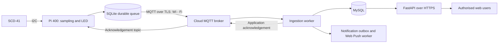

# Smart Box: IoT G-CA1 design

**Team:** SD3a-G2

**Date:** 9 October 2026

**Submission deadline:** Sunday 11 October, 23:55 (Europe/Dublin).

## 1. Purpose, users and scope

Smart Box (also called TempSafe) monitors temperature inside one prototype medication box. The
intended user is an Advanced Paramedic who needs clear warnings and a trustworthy history with minimal interaction. This
assessment delivers a design; hardware integration and application execution are planned, not demonstrated here. No real
medicines or patient data are used. Monitoring does not determine whether a medicine is suitable for use.

The [persona](../requirements/user-persona.md), [scope](project-scope.md), [requirements](../requirements/functional-requirements.md)
and [MoSCoW priorities](../requirements/moscow-prioritisation.md) provide the detailed rationale. The physical prototype
is mains-powered on a bench. Ambulance operation is an intended future use case requiring separate power, connectivity,
enclosure and accuracy validation.

| User story                                                                                                                    | Acceptance evidence                              |
|-------------------------------------------------------------------------------------------------------------------------------|--------------------------------------------------|
| As an assigned paramedic, I want to see current temperature and its age so I can distinguish a current warning from old data. | TP-03, TP-11 and UX-05 in the initial test plan. |
| As a paramedic, I want local warnings during an internet outage so I can recognise a problem near the box.                    | TP-08, TP-09 and TP-14.                          |
| As an assigned user, I want a graph and readable table so I can review earlier temperature changes.                           | TP-13 and UX-04.                                 |
| As an assigned user, I want clear phone warnings so I can identify which box needs attention.                                 | TP-18 to TP-20 and UX-06.                        |

## 2. Hardware, power and procurement

Use the team's existing Raspberry Pi 400, Adafruit SCD-41 breakout, microSD card, breadboard, jumper wires and one
single-colour LED with a current-limiting resistor. See the [parts list](../hardware/hardware-parts-list.md)
and [wiring drawing](../hardware/prototype-wiring.md). Connect sensor VIN to physical pin 1 (3.3 V), GND to pin 6, SDA
to pin 3 and SCL to pin 5. Proposed LED connection: physical pin 11 (BCM GPIO17), 1 kΩ series resistor, LED anode; LED
cathode to physical pin 9 (ground). Verify polarity and actual LED ratings before applying power. Never connect an LED
directly to a GPIO pin. The buzzer is optional and needs a circuit selected from its actual current rating; its GPIO
connection is not yet approved.

Use a compatible 5 V / 3 A USB-C supply for the Pi 400. Keep the controller outside the monitored box and route the
sensor cable through a protected opening to reduce controller heat effects. This mains arrangement does not provide
portable operation. A mobile revision must select a regulated power bank capable of the controller's load, measure
runtime and decide between a phone hotspot and a separately researched cellular modem. No GSM module is required for the
bench scope; uninterrupted mobile connectivity is not claimed.

Before submission, Hanna inventories owned parts and identifies missing LED/resistor, enclosure and cables. Order
missing parts at the start of implementation.

Manufacturer
references: [Adafruit breakout pinouts](https://learn.adafruit.com/adafruit-scd-40-and-scd-41/pinouts), [Raspberry Pi GPIO](https://www.raspberrypi.com/documentation/computers/raspberry-pi.html#gpio-and-the-40-pin-header), [Sensirion SCD41 and linked datasheet](https://sensirion.com/products/catalog/SCD41).
The SCD41 primarily measures CO₂ using photoacoustic sensing and contains integrated temperature/humidity sensing. Only
temperature is retained in this project.

## 3. Architecture and secure pub-sub communication



A cloud virtual machine hosts Mosquitto, an ingestion worker, FastAPI and MySQL for the prototype. Hosting provider,
region, domain and account ownership require team selection; no deployment is claimed. MySQL listens only on the
private/local interface. Restrict public access to HTTPS and authenticated MQTT/TLS; administration uses restricted
SSH access.

| Topic                                  | Publisher        | Subscriber       | Policy                                                    |
|----------------------------------------|------------------|------------------|-----------------------------------------------------------|
| `smartbox/v1/boxes/{box_id}/samples`   | Assigned device  | Ingestion worker | QoS 1, non-retained; historical events.                   |
| `smartbox/v1/boxes/{box_id}/heartbeat` | Assigned device  | Ingestion worker | QoS 1, non-retained; live contact only.                   |
| `smartbox/v1/boxes/{box_id}/challenge` | Ingestion worker | Assigned device  | QoS 1, non-retained; expiring single-use heartbeat nonce. |
| `smartbox/v1/boxes/{box_id}/ack`       | Ingestion worker | Assigned device  | QoS 1, non-retained; committed sample ID.                 |

## 4. Data contract, storage and processing

Every 30 seconds, persist an attempt locally before publishing. Heartbeats occur every 60 seconds. Store UTC times and
render clearly labelled local times in the interface. At least 2,880 pending attempts cover 24 hours. Reserve storage
headroom, monitor queue capacity and show storage failure rather than silently discarding pending data.

```json
{
  "schema_version": 1,
  "sample_id": "32cb1c3f-097f-41d5-9e99-85d98c3da2b1",
  "box_id": "box-001",
  "sequence_no": 42,
  "profile_id": "539ca70a-17ca-40d0-8884-c03fe65a530b",
  "observed_at": "2026-10-09T10:00:00Z",
  "clock_reliable": true,
  "temperature_c": 24.2,
  "quality": "valid"
}
```

For sensor errors use `temperature_c: null` and `quality: "sensor_error"`; for unreliable clocks use a null observation
time and a false clock flag. The server adds receipt time and derives the recorded band using the immutable profile.
Validate topic identity against the payload box, types, schema version, size, sequence, finite values and profile
ownership. Preserve observation and receipt times separately.

The [database research](../research/database-research.md) supplies relational tables, foreign keys and parameterised
queries; [schema.sql](../../database/schema.sql) extracts that proposed schema for review.
`auth_subject` is the login identifier; `password_hash` stores the Argon2id hash for the proposed local-account design.
Boxes link to users through `box_access`; each sample links to the profile for that box. Optional review records do not
alter measurements. Local SQLite stores pending messages and the persistent next sequence atomically.

Let L < W < U. A valid temperature below L or above U is Alert; W through U is Warning; L through values below W is
Normal. Demonstration W = 24°C and U = 25°C; L must be agreed before tests. The LED is off for Normal and steadily lit
for Warning/Alert. Proposed sensor-error feedback is two short flashes followed by a pause. Application colour is
supplemented by words and symbols. The buzzer remains Should Have.

Proposed stale-reading threshold: 90 seconds; proposed device-contact timeout: 180 seconds. Present the recorded band
separately from freshness. An old Normal reading cannot establish current Normal conditions. Latest state follows
persistent device sequence, so delayed lower-sequence uploads enrich history without replacing current state. Unreliably
timed readings remain explicitly unknown in timed history. Estimated excursions are optional: break intervals at
missing/error samples and label duration as an estimate.

Provision lock directories with service ownership. Stale checks create one transition event per outage. Summary jobs
recompute affected periods after delayed uploads. Backups are encrypted and copied off-host; test restoration. Proposed
prototype retention is 90 days for samples and 14 daily backups, subject to team agreement. Retention uses bounded
transactions and runs only after a successful backup. Log job outcomes and surface failures to maintainers.

## 5. Security and privacy

| Threat                                       | Proposed control                                                                                                                                              | Verification                                                             |
|----------------------------------------------|---------------------------------------------------------------------------------------------------------------------------------------------------------------|--------------------------------------------------------------------------|
| Device impersonation or cross-box publishing | Individual client certificates, broker topic ACLs and payload/topic identity checks; revocation procedure.                                                    | Attempt wrong certificate, wrong topic and forged box ID.                |
| Interception                                 | Certificate-validated MQTT/TLS and HTTPS; no plaintext fallback.                                                                                              | Reject untrusted/expired certificates.                                   |
| Unauthorised history access                  | Server-side box authorisation on every read/export/review operation.                                                                                          | Assigned and unassigned API tests.                                       |
| Account compromise                           | Argon2id password hashes, rate-limited login, generic failure messages; Secure/HttpOnly/SameSite cookies, session expiry and server-side logout invalidation. | Authentication, expiry and session-reuse tests.                          |
| Injection and browser attacks                | Parameterised SQL, validated request schemas, output escaping, CSRF protection for cookie-authenticated mutations.                                            | Malformed input and CSRF tests.                                          |
| Device theft or exposed credentials          | Locked enclosure where feasible, restricted OS accounts, protected key files, updates and immediate credential revocation; keep secrets out of Git.           | Inspect permissions and test revocation. Physical access remains a risk. |
| Database or backup disclosure                | Private database endpoint, least-privilege service user, host/storage encryption and encrypted backups.                                                       | Inspect configuration and restore with authorised credentials.           |
| Duplicate/replayed data                      | Stable sample IDs and content comparison, persistent sequence, explicit application acknowledgement and fresh heartbeat challenge.                            | Duplicate, replay and delayed-upload tests.                              |

Collect synthetic box temperatures, box identifiers and minimal test-account data. Do not collect patient information,
GPS, medication inventories or real operational records. Restrict access to notification subscriptions and logs; redact
credentials and tokens. Provide account/subscription removal and a documented retention policy.

## 6. UI and notifications

[UI wireframes](//TODO) show sign-in, current status and history. They use synthetic values
and are design artefacts, not a functioning application. The authenticated user sees only their assigned box. Display
temperature/unit, recorded status, observation time, last contact and freshness separately. Provide a date range, graph
and equivalent table, with visible gaps and error labels. Empty, denied-access, stale, sensor-error and offline states
need explicit wording. Use labelled fields, visible focus, keyboard navigation, text/symbol warnings and readable
contrast.

Proposed phone channel: browser Web Push with a service worker and explicit permission. Confirm browser/platform support
during implementation; a denied or unsupported permission must be visible. The worker commits a notification outbox item
with each eligible current-state transition, then retries delivery separately. Suppress unchanged repeated states,
prevent duplicate outbox events and mark provider failures. Historical uploads do not trigger current warnings. The
proposed target is receipt within 60 seconds of an online Warning/Alert transition; measure it on supported phones
rather than claiming guaranteed delivery. Subscribers receive notifications only for authorised boxes. Notification text
links to the authenticated dashboard; it does not expose sensitive account information.

## 7. Testing and success criteria

The [initial test plan](../testing/initial-test-plan.md) defines boundary, authorisation, sensor, offline, duplicate,
history and accessibility cases. Add automated API tests for certificate/topic rejection, schema validation and
cross-box requests; browser tests for sign-in, history filters, keyboard navigation and stale-state rendering. Simulated
input tests verify logic but do not establish hardware accuracy.

Invite intended users where available; otherwise identify participants as proxies rather than paramedics. Obtain
consent, use synthetic data and avoid recording identifiable details unnecessarily. Ask participants to sign in,
identify a warning, distinguish stale data and find an earlier flagged sample without coaching. Record task completion,
time, errors and feedback. Proposed success targets: every participant distinguishes stale data from current Normal; at
least 80% complete the core journey unaided; all Must Have functional cases pass; 24-hour queue reconciliation shows no
unexplained loss/duplicates. Small participant samples are formative and do not establish clinical suitability. No tests
have been executed for the application yet.

## 8. Responsibilities

| Member            | Proposed G-CA1 work                                                                    | Implementation responsibility                     |
|-------------------|----------------------------------------------------------------------------------------|---------------------------------------------------|
| Nikita Smiichyk   | Review architecture, data schema, processing, security and test plan.                  | Backend, database and automated tests.            |
| Hanna Bokariuk    | Verify hardware inventory/wiring, procurement, persona and Universal Design decisions. | Hardware, calibration and user evaluation.        |
| Maryna Hordiienko | Review UI wireframes, interaction flows and accessibility acceptance criteria.         | Frontend, Web Push integration and browser tests. |

## 9. Assessment traceability

| Criterion                     | Evidence                                                                                                                          |
|-------------------------------|-----------------------------------------------------------------------------------------------------------------------------------|
| Documentation (20%)           | This design, linked scope/requirements and individually identifiable review commits.                                              |
| Hardware (20%)                | Parts list, wiring SVG/PNG, manufacturer references, power/procurement discussion. A native Fritzing diagram remains outstanding. |
| Data/storage/processing (20%) | Data contract, database schema/queries, queue semantics and explicit cron entries.                                                |
| Security/privacy (10%)        | Threat/control/test table and secure pub-sub design.                                                                              |
| UI/users/testing (20%)        | Wireframes, persona, user stories and functional/automated/end-user test proposals.                                               |
| Version control (10%)         | Accessible repository and genuine incremental contributions; verify before submission.                                            |

See the [submission checklist](iot-gca1-submission-checklist.md) for critical items
