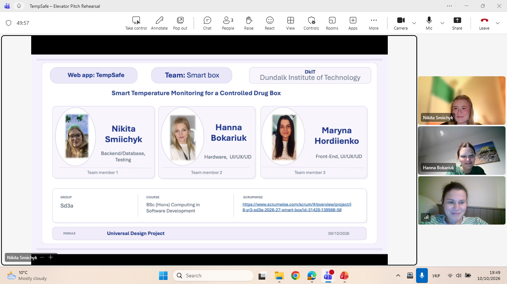
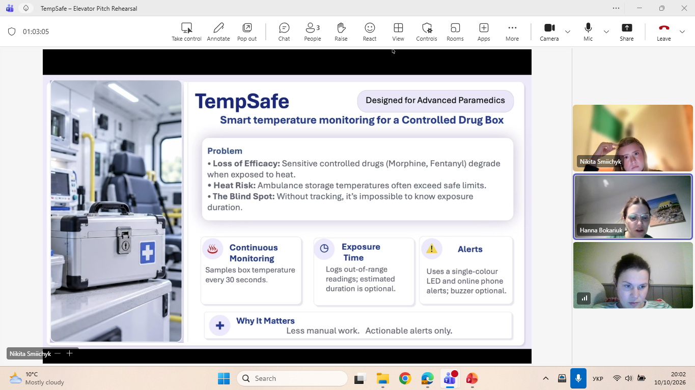
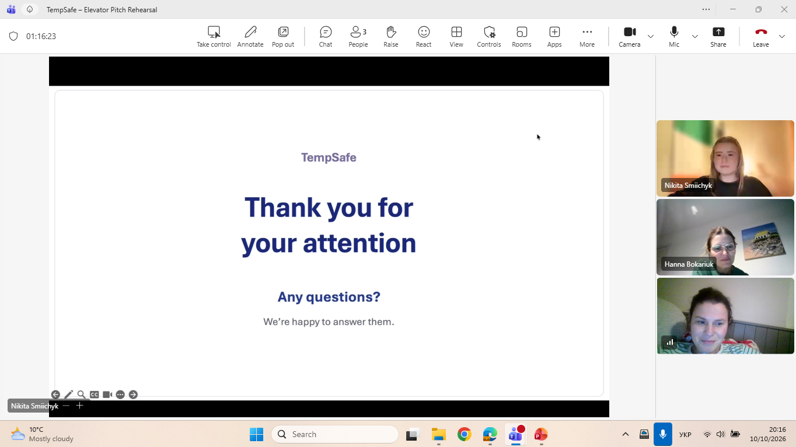

# Team meetings

## 10 October 2026 – Elevator pitch rehearsal (Microsoft Teams)

**Attendees:** Nikita Smiichyk, Hanna Bokariuk, Maryna Hordiienko
**Duration:** about 1 hour 20 minutes

### Agenda
- Rehearse the full elevator pitch, slide by slide
- Agree speaking order and transitions
- Discuss likely questions about users, features, hardware and Universal Design

### Speaking order

| Slide | Content | Presenter |
|---|---|---|
| 1 | Title and team | Hanna Bokariuk |
| 2 | Problem and TempSafe features | Hanna Bokariuk |
| 3 | How TempSafe works (prototype and component connections) | Nikita Smiichyk |
| 4 | Shannon's Dashboard (user journey and Universal Design) | Maryna Hordiienko |
| 5 | Thank you and questions | Maryna Hordiienko |

### Outcome
- The team went through every slide together, from the title slide to the closing slide.
- All three members attended and practised their sections.
- Remaining tasks before submission: AI usage cover sheet, lecturer access to the repository, final ZIP and Moodle upload.

### Evidence

