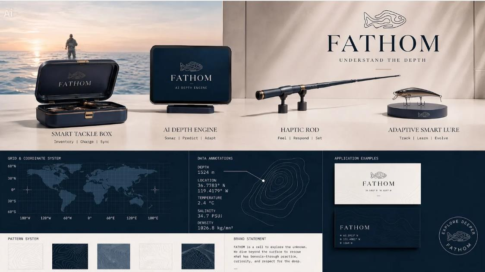
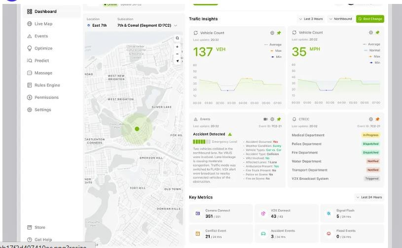
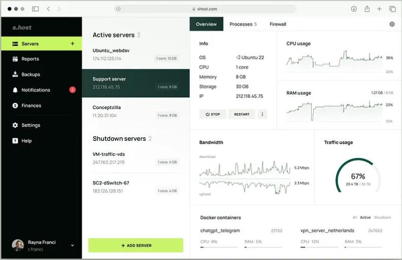
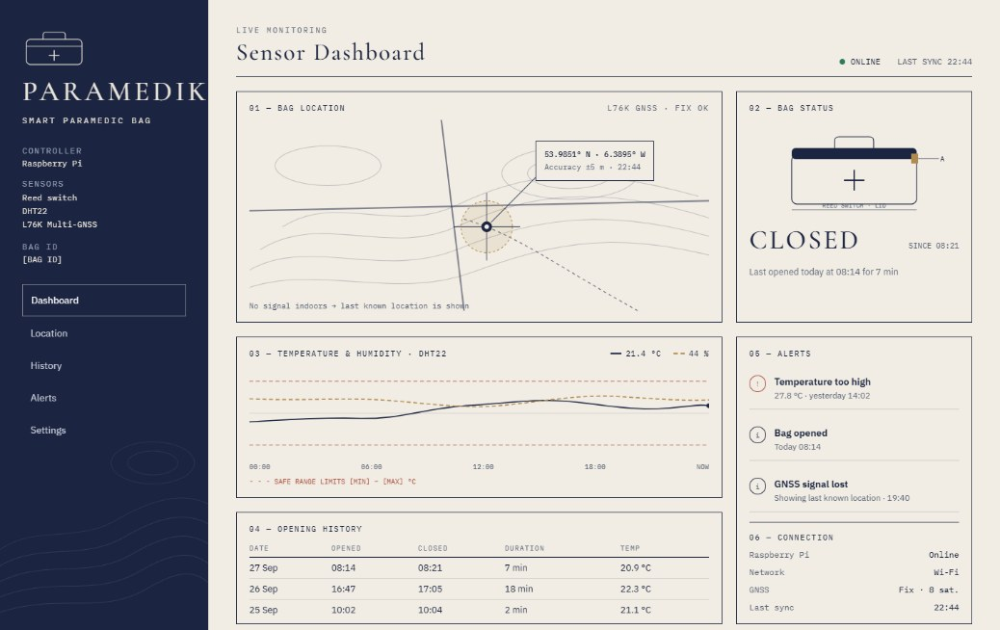

# Research – User Dashboard Design Templates

**Author:** Maryna Hordiienko (Front-End, UI/UX/UD)  
**Sprint:** Sprint 1 – Design research

> **Note:** This research was done in Sprint 1, when the project was called *Paramedik Box* and the scope still included
> bag location. The project is now **TempSafe**. The final dashboard uses a different visual style that matches the team
> presentation, but some ideas from this research were kept: large live values, a clear status, an event list and simple
> temperature charts.

---

## 1.1 FATHOM – Understand the Depth

*Source: "FATHOM — Understand the Depth" by Cuih on Dribbble*

This dashboard caught our interest because it shows location and sensor data in a simple and elegant way. The coordinate
grid, the data annotations (location, temperature, depth) and the contour map are similar to what our app needs to show
for the Paramedik bag. We are considering it as inspiration for our dashboard, especially the way it presents live data
clearly without looking too busy.

## 1.2 Kemetra – Transportation Management Dashboard

*Source: "Kemetra – Transportation Management Dashboard UI" by Wavespace – UI/UX Design Agency on Dribbble*

This dashboard is interesting to us because it combines a live map with real-time sensor data on one screen. The map
with a location marker, the large live numbers with small charts, and the list of events and alerts are very similar to
what our app needs to show: bag location, temperature and when the bag was opened. We also like the clean white layout
with a side menu, because it is easy to read and use quickly.

## 1.3 Server & Hosting Management Dashboard

*Source: "Server & Hosting Management Dashboard UI/UX Design" by Shakuro on Dribbble*

This dashboard is interesting to us because it shows how to monitor several devices at the same time. The list on the
left (active and shutdown servers) could work for our app if a team has more than one paramedic bag, with each bag
showing its status as online or offline. We also like the live line charts and the circular progress indicator, which
could be used to show temperature and humidity changes in a clear and simple way.

---

## First concept (Sprint 1) – Paramedik sensor dashboard

We chose the **Fathom** design because, like our project, it presents a smart product with sensors and data. It shows
each product clearly, with short labels that explain what it does (for example, *Track | Learn | Evolve*). The navy and
cream colours look elegant and trustworthy, and the coordinate grid and data sections show location and sensor readings
in a simple way. This makes it a good match for the Paramedik bag, which also tracks location and temperature.

---

*Images are screenshots of public Dribbble shots, used for educational research only. All rights belong to their
original authors.*
