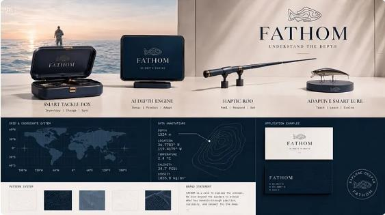
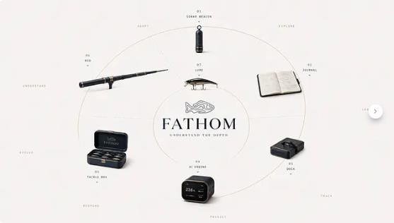
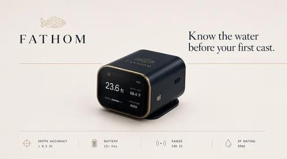
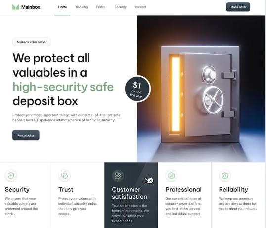
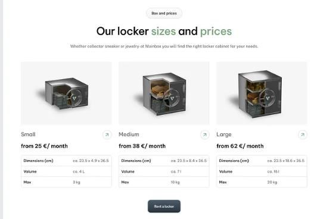
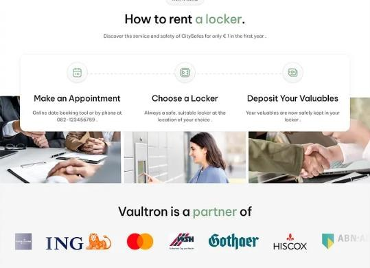
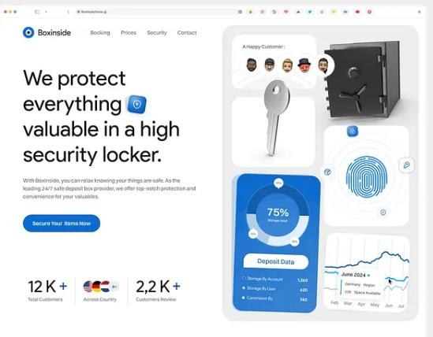
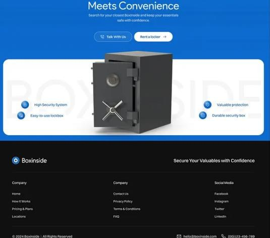
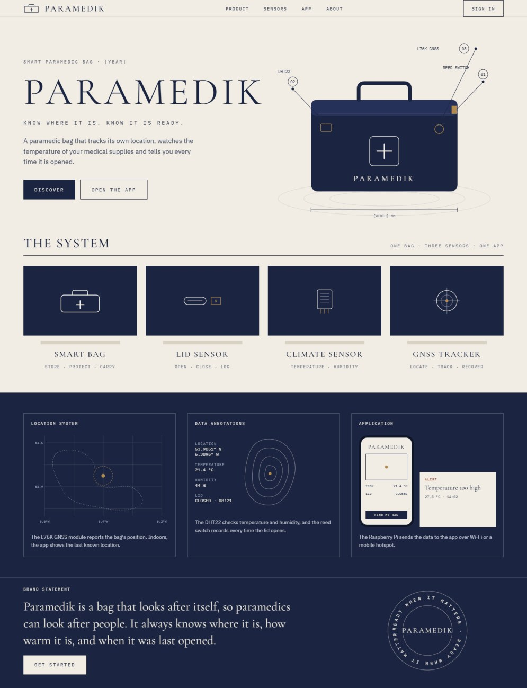

# Research – Website Design Templates

**Author:** Maryna Hordiienko (Front-End, UI/UX/UD)  
**Sprint:** Sprint 1 – Design research

> **Note:** This research was done in Sprint 1, when the project was called *Paramedik Box*. The project is now
> **TempSafe**, and the final visual style was changed to match the team presentation. This file records the options
> explored and the reasons behind the first concept.

---

## 1. FATHOM – Understand the Depth

*Source: "FATHOM — Understand the Depth" by Cuih on Dribbble*

The first example looks very stylish and modern, and we liked its colour combination. The dark night-sky background with
white and bright accent colours makes the product stand out and look professional. The layout is clean and simple: a
large product image in the centre, a short title and one clear button, so the user immediately understands what the
product is.

## 2. Mainbox – Safe Deposit Box Landing Page

*Source: "Mainbox – Safe Deposit Box Landing Page" by Elux Space on Dribbble*

We chose this example because it is clean, bright and easy to read, which is quite different from the dark style of the
first one. The white background with soft green accents feels calm and trustworthy, and this is important for a product
that protects valuable things, just like our paramedic bag protects medical supplies. We also liked how the information
is organised: the feature cards (Security, Trust, Reliability). This structure could work well for our home page to show
the main features of the bag and how the app works.

## 3. Boxinside – Safe Deposit Box Landing Page

*Source: "Boxinside – Safe Deposit Box Landing Page" by Elux Design for Elux Space on Dribbble*

What makes this example stand out is the way it mixes a website with dashboard elements. The right side uses a "bento"
grid of small cards with a chart, a circular progress indicator and data numbers, which is very close to what our app
needs to show, such as temperature, location and bag status. The blue and white colour scheme looks fresh and modern,
and the large statistics at the bottom (12K+ customers) build trust quickly. We could use this idea to give users a
small preview of the dashboard directly on our home page.

---

## First concept (Sprint 1) – Paramedik website

We chose this style because it looks calm, professional and a little different from typical medical websites. The dark
navy and cream colours are easy on the eyes and give the product a serious, trustworthy feel, which is important for a
medical bag. The technical drawing of the bag, with numbered labels, clearly shows where each sensor is placed and what
it does. The page is organised into clear sections, so the user can quickly understand the product, the sensors and the
app. We also like that the design shows real data, like location and temperature, so users can see how the system works
before they use it. Overall, this style fits our project well because it combines a clean modern look with useful
technical information.

---

*Images are screenshots of public Dribbble shots, used for educational research only. All rights belong to their
original authors.*
