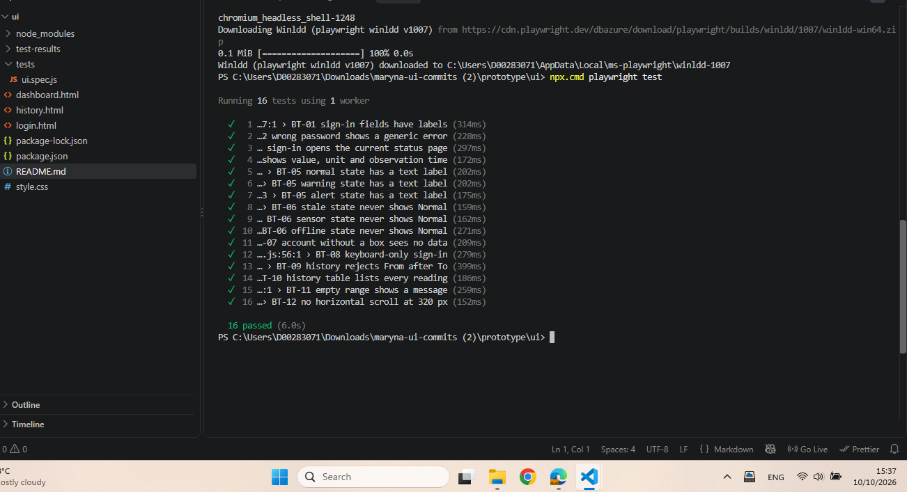

# Automated browser test plan (UI)

Author: Maryna Hordiienko

This plan adds automated browser tests to the manual UX tests in `initial-test-plan.md` (UX-01 to UX-06). Automated UI tests use Playwright. They run against the HTML prototype now (`prototype/ui`) and will run against the FastAPI web application during implementation. The test code is in `prototype/ui/tests/ui.spec.js`.

| ID | Test | Expected result | Criteria |
|---|---|---|---|
| BT-01 | Sign-in page fields have labels. | Inputs can be found by their label text. | AC-05 |
| BT-02 | Sign in with a wrong password. | Generic "Sign-in failed" message; stays on sign-in page. | AC-10 |
| BT-03 | Sign in with valid test credentials. | Current status page opens. | US-UI-01 |
| BT-04 | Current status shows value, unit and observation time. | Text such as "24.6°C" and "Observed 14:17:30" is visible. | AC-12 |
| BT-05 | Normal, Warning and Alert states have a text label (3 tests). | The heading NORMAL, WARNING or ALERT is visible. | AC-01 |
| BT-06 | Stale, sensor error and offline states never show Normal (3 tests). | The word "NORMAL" is not on the page in these states. | AC-11 |
| BT-07 | No assigned box state. | "No assigned box available"; no temperature on the page. | US-UI-08 |
| BT-08 | Keyboard-only sign-in. | Tab to fields, type, press Enter; dashboard opens. | AC-03 |
| BT-09 | History filter with From after To. | Error "The start time must be before the end time." | AC-10 |
| BT-10 | History table lists every reading. | 81 rows for 14:00–14:40, including rows for missing data. | AC-07 |
| BT-11 | History range with no readings. | "No observations found for this period." | US-UI-06 |
| BT-12 | Mobile viewport 320 px. | No horizontal scroll on the current status page. | AC-09 |

BT-05 and BT-06 run once for each of three states, so the suite contains 16 tests for 12 IDs.

Not yet automated (checked manually with UX-01, UX-02 and UX-04 in `initial-test-plan.md`): status symbols and `role="status"`/`role="alert"` (AC-01, AC-06), visible focus outline (AC-04), contrast (AC-02) and touch target size (AC-08).

## Running the tests

```bash
cd prototype/ui
npm init -y
npm install -D @playwright/test
npx playwright install chromium
npx playwright test
```

On Windows PowerShell, use `npm.cmd` and `npx.cmd` if running scripts is disabled.

## Test run record

| Date | Tester | Environment | Result |
|---|---|---|---|
| 10/10/2026 | Maryna Hordiienko | Windows, Node v24.13.0, Playwright Chromium | 16 passed, 0 failed |


